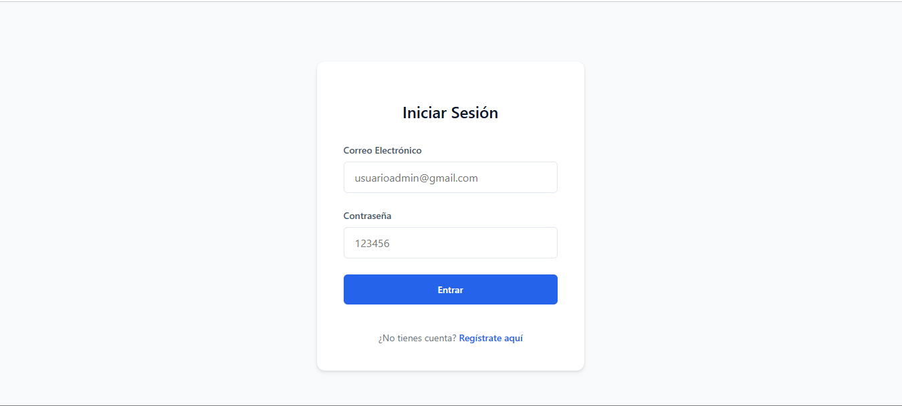
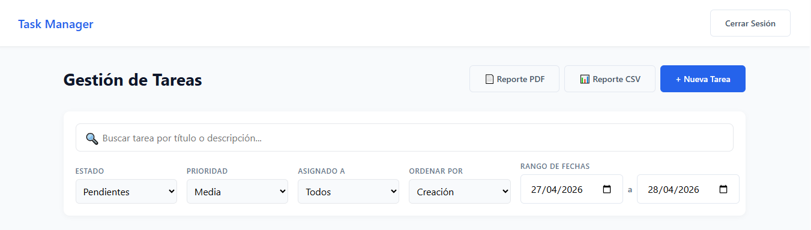
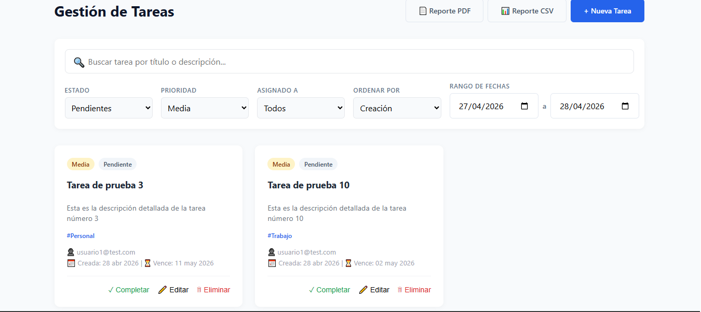
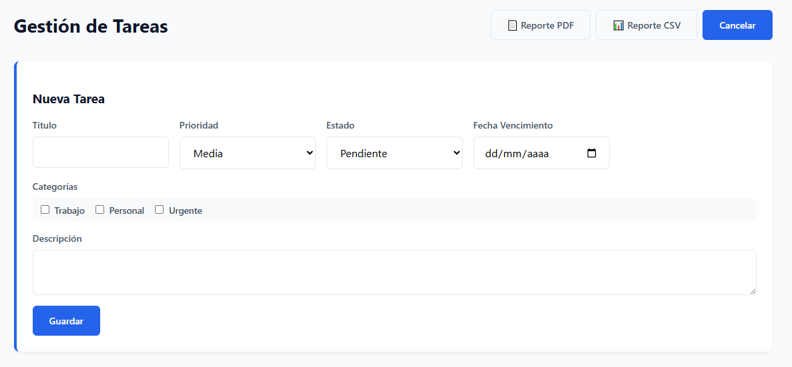
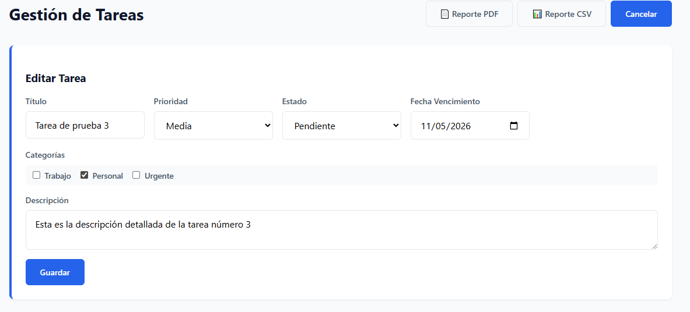
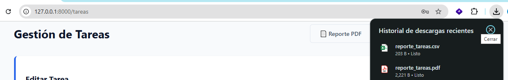
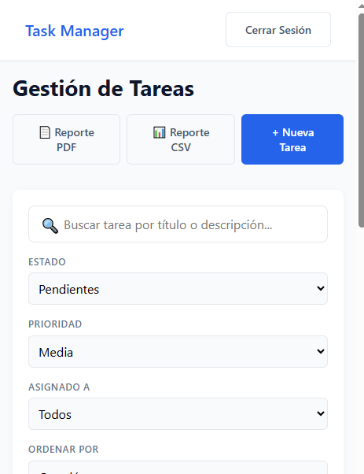
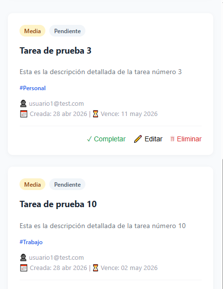

# PRUEBA TECNICA FULLSTACK: Sistema de Gestión de Tareas

Autor: Edwin Sneider Velandia Suarez

## Requisitos previos

- PHP 8.3
- Node.js 18+ y npm
- MySQL 8

---

## Instalación

### 1. Clonar el repositorio

```bash
git clone https://github.com/edwsvesu/prueba_gestion_tareas
```

### 2. Instalar dependencias PHP

```bash
composer install
```

### 3. Instalar dependencias JavaScript

```bash
npm install
```

### 4. Configurar el entorno

Se sugiere usar la siguiente conexión en el archivo de configuración de entorno

```dotenv
DATABASE_URL="mysql://root:@127.0.0.1:3306/gestion_tareas?serverVersion=8.0.32&charset=utf8mb4"
```

La clave JWT ya está preconfigurada en el `.env`.

### 5. Crear la base de datos y ejecutar migraciones

```bash
php bin/console doctrine:database:create
php bin/console doctrine:migrations:migrate --no-interaction
```

### 6. Cargar datos de prueba

Se crean datos de ejemplo para facilitar pruebas: usuarios con dos perfiles (admin y usuario regular) y categorias de ejemplo.

```bash
php bin/console doctrine:fixtures:load --no-interaction
```

**Credenciales de acceso tras los fixtures:**

- usuarioadmin@gmail.com - clave 123456 - admin
- usuario1@gmail.com@gmail.com - clave 123456 - regular

### 7. Compilar el frontend

```bash
npm run dev
```

### 8. Iniciar el servidor

```bash
symfony server:start
```

---

## Capturas de pantalla

### Pantalla de login/registro


### Dashboard de tareas con filtros activos





### Panel de creación / edición de tarea





### Exportación de reporte en PDF


### Vista mobile





---

## Endpoints de la API

Todos los endpoints bajo `/api` requieren el header:
```
Authorization: Bearer <jwt_token>
```

### Autenticación

| Método | Endpoint | Descripción |
|--------|----------|-------------|
| POST | `/api/login_check` | Obtener JWT + refresh token |
| POST | `/api/register` | Registrar nuevo usuario |
| POST | `/auth/refresh` | Renovar JWT con refresh token |
| POST | `/api/forgot-password` | Solicitar recuperación de contraseña |
| POST | `/api/reset-password` | Confirmar nueva contraseña con token |

### Tareas

| Método | Endpoint | Descripción | Rol |
|--------|----------|-------------|-----|
| GET | `/api/tareas` | Listar tareas con filtros | TODOS |
| GET | `/api/tareas/{id}` | Detalle de una tarea | TODOS |
| POST | `/api/tareas` | Crear tarea | TODOS |
| PUT/PATCH | `/api/tareas/{id}` | Editar tarea | TODOS |
| DELETE | `/api/tareas/{id}` | Eliminar tarea | ADMIN |

**Filtros disponibles en `GET /api/tareas`:**

```
?estado=pendiente
?prioridad=alta
?usuario_id=1
?search=nombre
?fecha_inicio=2024-01-01&fecha_fin=2024-12-31
?sort_by=fechaCreacion&sort_order=DESC
```

### Reportes

| Método | Endpoint | Descripción |
|--------|----------|-------------|
| GET | `/api/reportes/tareas?formato=pdf` | Reporte PDF personalizable |
| GET | `/api/reportes/tareas?formato=csv` | Reporte CSV personalizable |

Los reportes aceptan los mismos filtros que el listado de tareas

---

## Reporte diario automático

El sistema incluye un comando de Symfony para generar el reporte diario de tareas activas:

```bash
php bin/console app:reporte-diario
```

El archivo PDF se guarda automáticamente en `var/reportes/...`.

---

## Análisis de rendimiento — EXPLAIN de la consulta principal

La consulta principal del sistema es la que lista tareas con filtros dinámicos, joins y ordenamiento. Se ejecuta desde `TareaRepository::findTareasByFilters()`.

**SQL equivalente analizado:**

```sql
EXPLAIN
SELECT t.id, t.titulo, t.estado, t.prioridad, t.fecha_creacion, t.fecha_vencimiento,
       u.id AS usuario_id, u.email,
       c.id AS categoria_id, c.nombre
FROM tarea t
LEFT JOIN usuario u ON t.usuario_id = u.id
LEFT JOIN tarea_categoria tc ON t.id = tc.tarea_id
LEFT JOIN categoria c ON tc.categoria_id = c.id
WHERE t.estado = 'pendiente'
ORDER BY t.fecha_creacion DESC;
```

**Resultado del EXPLAIN:**

| id | select_type | table | type | possible_keys | key | key_len | ref | rows | Extra |
|----|-------------|-------|------|---------------|-----|---------|-----|------|-------|
| 1 | SIMPLE | t | ALL | — | — | — | — | N | Using filesort |
| 1 | SIMPLE | u | eq_ref | PRIMARY | PRIMARY | 4 | t.usuario_id | 1 | — |
| 1 | SIMPLE | tc | ref | PRIMARY, IDX_tarea_id | IDX_tarea_id | 4 | t.id | 1 | Using index |
| 1 | SIMPLE | c | eq_ref | PRIMARY | PRIMARY | 4 | tc.categoria_id | 1 | — |


- Los joins a `usuario` y `categoria` utilizan sus claves primarias (`eq_ref`), lo cual es óptimo.
- La tabla `tarea_categoria` aprovecha el índice generado sobre `tarea_id`.
- El filtro por `estado` realiza un full scan (`ALL`) porque la columna no tiene índice propio.

Para el volumen de datos de esta aplicación, el rendimiento actual es aceptable. Si una base de datos como esta crece, propongo estos indices adicionales:

```sql
CREATE INDEX idx_tarea_estado ON tarea (estado);

-- Índice compuesto si el filtro más común es estado + fecha
CREATE INDEX idx_tarea_estado_fecha ON tarea (estado, fecha_creacion);
```

---

## Recuperación de contraseña

El flujo de recuperación de contraseña está implementado a nivel de API, en producción el token se enviaría por email.

1. `POST /api/forgot-password`
2. `POST /api/reset-password`